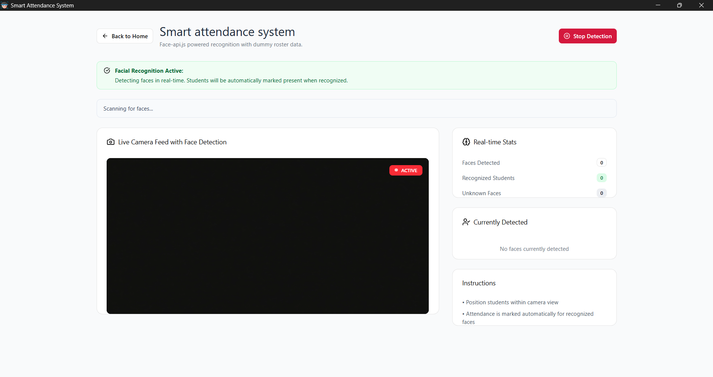

# Smart Attendance System

Smart Attendance System is a desktop attendance app built with Tauri, React, TypeScript, and Rust. It uses the device camera and `face-api.js` models to match enrolled students against a live video feed, then stores attendance data in a local SQLite database.

## Screenshots


## What It Does

- Live webcam preview for attendance capture.
- Face recognition using local model files in `public/models`.
- Student management from an admin panel.
- Attendance history and basic analytics.
- Local persistence through a Tauri-backed SQLite database.

## Tech Stack

- Frontend: React, TypeScript, Vite.
- Desktop shell: Tauri 2.
- Styling: Tailwind CSS and Radix UI primitives.
- Face recognition: `face-api.js`.
- Backend: Rust commands exposed through Tauri.
- Storage: SQLite in the user's app data directory.

## Project Structure

- `src/` contains the React app UI and face recognition logic.
- `src/app/components/` contains the home screen, admin panel, and engagement monitor.
- `src/app/lib/faceRecognition.ts` loads models and builds face matchers.
- `src-tauri/src/` contains the Rust commands and database layer.
- `public/models/` contains the bundled face-api.js model files.

## Download / Install

Prebuilt cross-platform executables (Windows, macOS, Linux) are published on the [Releases page](https://github.com/Abdelouahab-aourar/smart-attendance-system/releases). Download the installer for your platform and run it — no build step required.

## Requirements

- Node.js 20 or newer.
- pnpm.
- A desktop environment with camera access.
- Rust toolchain and the Tauri prerequisites for your platform.

## Installation

```bash
pnpm i
```

## Development

Run the Vite frontend during development:

```bash
pnpm dev
```

Run the Tauri desktop app with the frontend:

```bash
pnpm tauri dev
```

## How to Use

1. Start the app and allow camera access when prompted.
2. Stay on the home screen to confirm the webcam preview is working.
3. Select Start Attendance to open the live recognition screen.
4. Register students from the Admin Panel using a name and one or more face images.
5. Review attendance records and summary metrics in the admin tabs.

The admin login in the current app flow uses `admin` as the username and `password` as the password.